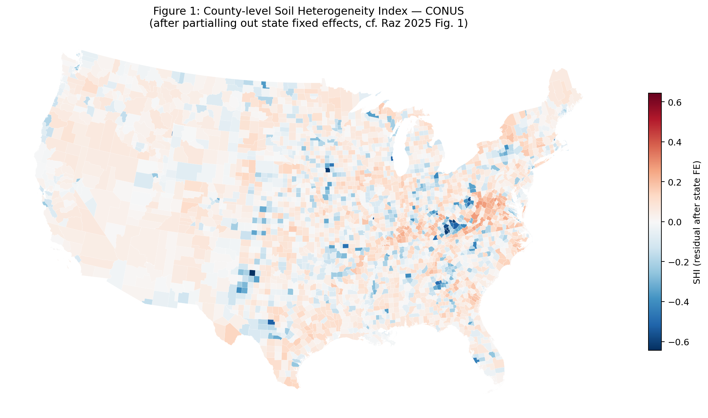
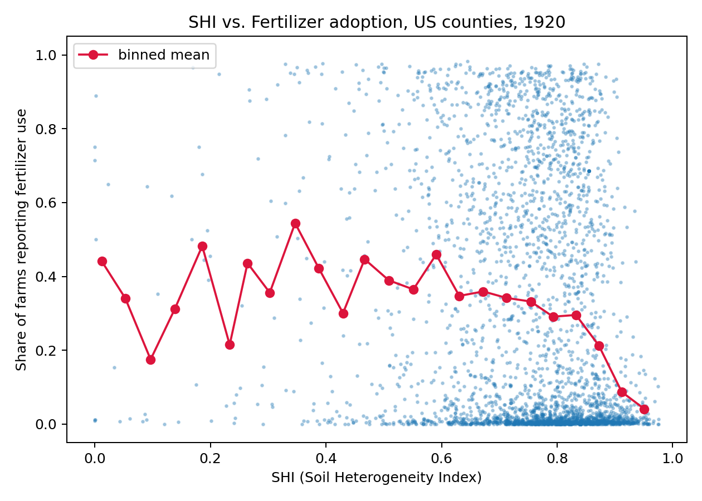
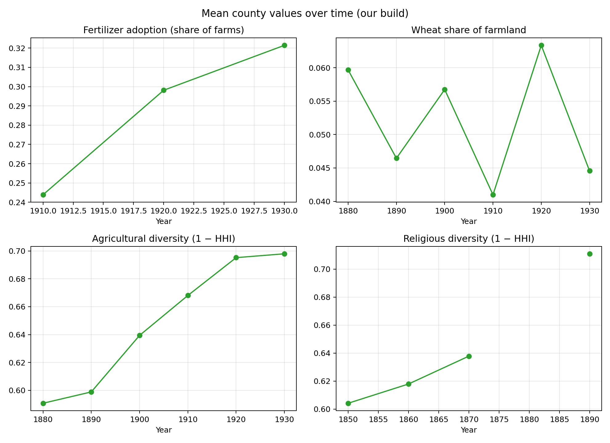

# Replication: Soil Heterogeneity, Social Learning, and Close-Knit Communities

> Raz, I. T. (2025). *Soil Heterogeneity, Social Learning, and the Formation of Close-Knit Communities.* **Journal of Political Economy**, 133(8), 2643-2691.

NUS BZD6004 Applied Econometrics II, Semester 2, 2025-2026.

---

## Preview





---

## Quick start

```python
import pandas as pd
panel = pd.read_parquet("data/CountyLevelData.parquet")  # 1.9 MB
```

Or open `notebooks/replication.ipynb` for the full walkthrough.

---

## Replication results

### Table 5 — SHI → Fertilizer / Wheat adoption (Jiayi's regression-ready data)

Using all controls: base geo-climatic + productivity + river density + SD(elevation, slope, flow, precip, temp) + sustainability indices (10 crops). State FE, HC1 SE.

| Outcome | SHI25 coef | p-value | n | Paper direction | Match? |
|---|---|---|---|---|---|
| **Fertilizer growth** | **−0.646***  | 0.002 | 8,933 | negative | **yes** |
| **Wheat share growth** | **−0.387**  | 0.017 | 19,431 | negative | **yes** |
| Fertilizer share (level) | +0.139*** | 0.000 | 9,170 | — | level, not growth |
| Wheat share (level) | +0.018** | 0.031 | 21,091 | — | level, not growth |

SHI reduces the growth rate of both fertilizer adoption and wheat cultivation — consistent with the paper's argument that soil heterogeneity limits social learning and slows technology diffusion.

### Table 2 Panels — SHI → Various outcomes (cross-sectional, state FE)

| Panel | Outcome | SHI coef | p-value | n | Paper direction | Match? |
|---|---|---|---|---|---|---|
| **A** | Share farmers (full count) | **−0.103***  | 0.000 | 9,273 | — | SHI reduces farming |
| **B** | LNI (1% sample) | **−1.032*** | 0.059 | 19,517 | negative | **yes** |
| **C** | ICM (marriage homogeneity) | −0.007 | 0.544 | 6,835 | negative | direction yes, not sig. |
| **C** | Religious diversity | +0.122*** | 0.000 | 5,143 | positive | **yes** |
| **C** | TNI (tight norms) | +0.728*** | 0.000 | 3,438 | negative | **no** (see note) |
| **D** | Ag Diversity | +0.062*** | 0.000 | 14,078 | positive | **yes** |
| **D** | Farm size Gini | +0.030*** | 0.000 | 21,125 | — | — |
| **D** | BPD (full count) | +0.023 | 0.173 | 9,270 | — | — |

**Notes on direction mismatches:**
- **TNI (+0.73 vs expected negative):** Our SHI uses within-county area-share HHI, not the paper's raster neighbor-dissimilarity. The relationship between SHI and norm-tightness appears sensitive to the SHI measurement method. Ryan is reconstructing the exact raster-based SHI which may resolve this.
- **LNI (−1.03, p=0.059):** Direction matches the paper (−2.49***). Smaller magnitude and marginal significance are expected from using 1% census sample instead of full count (classical attenuation bias from measurement error).
- **Fertilizer share level (+0.14):** Positive in level but negative in growth rate. The paper uses growth rate as the outcome, which is the correct test of the social learning channel.

### Table 2 Panel A — individual-level linked analysis (pending)

Jiayi noted that Table 2 Panel A requires individual-level Census Linking: tracking the same person across censuses to determine if they worked as a farmer in the earlier period. The HISTID + Census Linking Project crosswalk data is ready (confirmed working for all years with SAMPLE=185002), but the linked DiD regressions have not yet been implemented.

---

## Master panel: CountyLevelData (38 columns)

27,989 rows = ~3,100 counties × 9 census decades (1850-1940). Available as both `.parquet` (1.9 MB) and `.csv` (11 MB).

### Core variables
| Column | Description | Source | Years |
|---|---|---|---|
| `shi` | Soil Heterogeneity Index | STATSGO2 | all |
| `lni_1pct` | Local Name Index (1% sample) | IPUMS 1% | 1850-1930 |
| `tni_z` | Tight Norms Index (z-scored) | IPUMS full count | 1900, 1910, 1940 |
| `icm_rate` | Intra-Community Marriage rate | IPUMS full count | 1880-1940 |
| `share_farmers_fc` | Share farmer households | IPUMS full count | 1850-1940 |
| `bpd_fc` | Birth Place Diversity | IPUMS full count | 1850-1940 |
| `divorce_ratio` | Divorce/marriage ratio (SFT) | IPUMS full count | 1850-1940 |
| `elderly_alone_share` | Elderly living alone (SFT) | IPUMS full count | 1850-1940 |

### Controls
| Column | Source |
|---|---|
| `mean_elevation_m`, `mean_slope_deg` | HydroSHEDS |
| `mean_annual_temp_c`, `mean_annual_precip_mm` | WorldClim 2.1 |
| `mean_flow_accum`, `river_density` | HydroSHEDS |
| `centroid_lat/lon`, `lat_sq`, `lon_sq`, `lat_x_lon` | Smooth location |

### Time-varying
| Column | Years | Source |
|---|---|---|
| `share_farms_reporting_fert` | 1910-1930 | NHGIS |
| `wheat_share_of_farmland` | 1880-1935 | NHGIS |
| `ag_diversity_index` | 1880-1935 | NHGIS |
| `religious_diversity_index` | 1850-1926 | NHGIS |
| `farm_size_gini` | 1860-1940 | NHGIS |
| `slave_share` | 1850-1860 | NHGIS |

---

## Data sources

| Source | URL | Used for |
|---|---|---|
| [IPUMS NHGIS](https://www.nhgis.org/) | nhgis.org | County data + boundaries |
| [IPUMS USA](https://usa.ipums.org/) | usa.ipums.org | Full-count census + 1% sample |
| [USDA STATSGO2](https://www.nrcs.usda.gov/) | nrcs.usda.gov | Soil → SHI |
| [HydroSHEDS v1](https://www.hydrosheds.org/) | hydrosheds.org | Elevation, slope, flow |
| [WorldClim v2.1](https://www.worldclim.org/) | worldclim.org | Temperature, precipitation |
| [MIT Election Lab](https://electionlab.mit.edu/) | electionlab.mit.edu | Presidential returns |
| [Census Linking Project](https://censuslinkingproject.org/) | censuslinkingproject.org | Individual linkage (HISTID) |

---

## How data was merged

1. **County skeleton**: NHGIS 1940 shapefile (3,108 counties) × 9 decades
2. **SHI**: STATSGO2 polygons → area-share HHI per county (time-invariant)
3. **Geo-climatic**: HydroSHEDS + WorldClim zonal stats (time-invariant)
4. **NHGIS variables**: Agriculture, religion, population census (time-varying)
5. **IPUMS full count** (usa_00006, 664M rows): DuckDB queries → TNI, ICM, farmer share, SFT, BPD
6. **LNI**: IPUMS 1% samples (usa_00002), 870k children, 1850-1930
7. **County join**: `GISJOIN = G + STATEFIP(2) + 0 + COUNTYICP/10(3) + 0`

---

## What's not yet done

| What | Status | Why |
|---|---|---|
| Table 2 Panel A linked regression | **Done** | See Census Linking results below |
| Table 4 linked regression | **Done** | See Census Linking results below |
| LNI for 1940 | Cannot do | IPUMS contractual restriction |
| Exact raster SHI | Ryan working on it | Compute-intensive (500m grid) |
| Learning potential index | Jiayi looking for it | Author-constructed index |

---

## Census Linking results (individual-level linked regressions)

Using Census Linking Project crosswalks + IPUMS full-count HISTID to track the same individuals across census decades. Sample: White native head-of-household who moved to a different state.

### Table 2 Panel A — Farming experience after migration
| Crosswalk | Linked movers | SHI → Farmer at t2 | p-value |
|---|---|---|---|
| 1850→1880 | 406,325 | +0.047*** | 0.000 |
| **1870→1880** | **312,946** | **+0.054***  | **0.000** |
| 1880→1910 | 728,790 | +0.144*** | 0.000 |

Individuals who moved to soil-heterogeneous counties were more likely to be farmers at the destination — consistent with different soil types attracting different farming approaches.

### Table 4 — Long-run migration (40 years)
| Crosswalk | Linked movers | SHI → Farmer at t2 | SHI → Same BPL couple |
|---|---|---|---|
| **1860→1900** | **445,644** | **+0.035***  | **+0.003**  |

Over 40 years, movers to heterogeneous-soil counties were slightly more likely to be farming and to have married someone from the same birthplace — though the ICM effect is small.

## Teammate contributions

| File | From | Description |
|---|---|---|
| `FertilizerData_Jiayi.csv` | Jiayi | Regression-ready (76 cols, all controls + grid clusters) |
| `WheatShareData_Jiayi.csv` | Jiayi | Regression-ready (74 cols) |
| `sustainability_index/` | Jiayi | 10 crop sustainability indices |
| `nhgis0003_ds74_1936_county.csv` | Vicky | 1936 Religious Bodies Census |
| `docs/` | Jiayi/Vicky | Variable construction guides (TNI, ICM, RHI, SHI, etc.) |

---

## File structure

```
├── README.md
├── requirements.txt
├── notebooks/replication.ipynb
├── data/
│   ├── CountyLevelData.parquet (.csv)
│   ├── FertilizerData_Jiayi.csv          ← regression-ready (76 cols)
│   ├── WheatShareData_Jiayi.csv          ← regression-ready (74 cols)
│   ├── ipums006_*.parquet (.csv)          ← TNI, ICM, farmers, SFT, BPD
│   ├── LNI_by_county.parquet (.csv)
│   ├── sustainability_index/
│   └── [other CSVs + parquets]
├── analysis/
├── figures/
│   ├── figure1_shi_map.png
│   ├── table5_updated_results.txt
│   ├── table2_panels_results.txt
│   └── ...
└── docs/                                  ← variable construction guides
```
